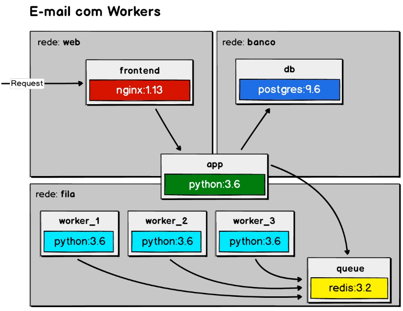

# Docker Guide

## Material

- [Conceitos](docker-concepts.md)
- [Comandos do Docker](docker-commands.md)
- [Estratégias de uso do Docker](docker-strategies.md)
- [Dockerfile](dockerfile-guide.md)
- [Docker network](docker-networks.md)
- [Docker compose](docker-compose.md)

## Exercícios para referência

### E-mail com Workers

Uso dos recursos do docker para orquestrar containers simulando uma aplicação de envio de emails.

