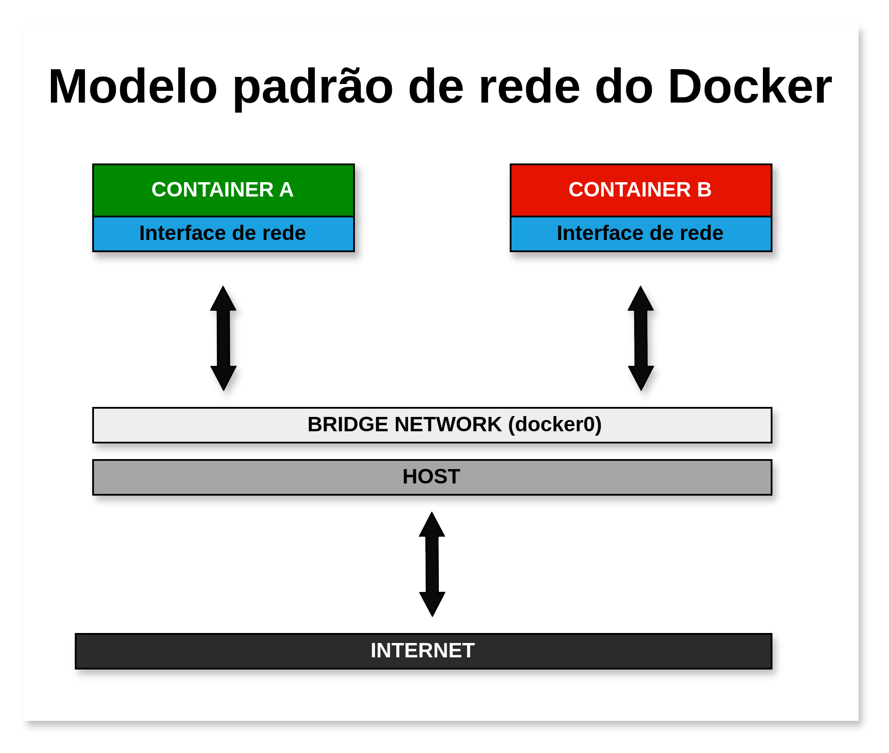
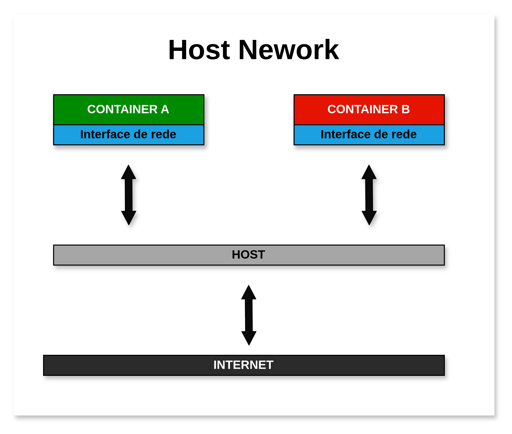
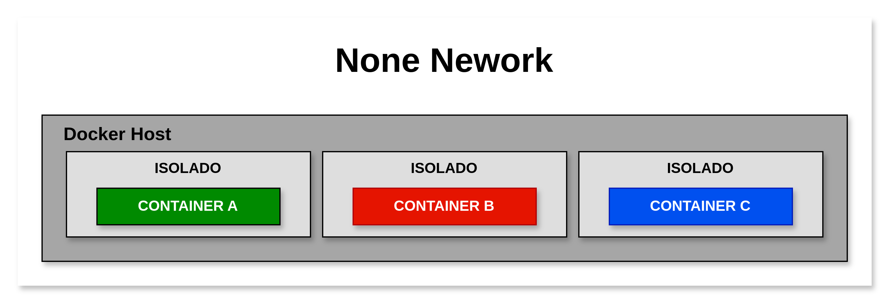

[**Voltar ao README**](README.md)

# Redes no Docker

No docker, redes são usadas para conectar containers entre si e com a máquina host. Elas permitem que os containers se comuniquem e compartilhem recursos, como volumes e portas de rede.

## Tipos de redes

O Docker suporta diferentes tipos de redes, cada um com suas características e usos específicos. Alguns dos tipos de redes mais comuns são:

- **Bridge**: Rede padrão do Docker. Cada container conectado a uma rede bridge recebe um endereço IP único dentro da sub-rede da rede bridge. Containers conectados à mesma rede bridge podem se comunicar entre si.



- **Host**: O container compartilha a rede da máquina host. Isso significa que o container tem acesso direto à interface de rede da máquina host e pode usar as mesmas portas de rede.



- **None**: O container não possui acesso à rede externa. Ele é isolado e não pode se comunicar com outros containers ou com a máquina host.



- **Overlay**: Rede que conecta containers em diferentes hosts. É usada em ambientes distribuídos, como clusters de Docker Swarm.

## Criando novas redes

Para criar uma nova rede no Docker, você pode usar o comando `docker network create` seguido do nome da rede. Por exemplo:

```bash
  docker network create my-network
```

Por padrão, a rede é criada no modo `bridge`. Você pode especificar o tipo de rede usando a opção `--driver`. Por exemplo, para criar uma rede do tipo `host`, você pode usar:

```bash
  docker network create --driver host my-network
```

## Listando redes

Para listar as redes disponíveis no Docker, você pode usar o comando `docker network ls`. Isso irá exibir uma lista de todas as redes criadas no Docker, juntamente com informações como ID, nome e driver.

```bash
  docker network ls
```

## Inspeção de redes

Para obter informações detalhadas sobre uma rede específica, você pode usar o comando `docker network inspect` seguido do nome ou ID da rede. Isso irá exibir informações como endereços IP, containers conectados e configurações da rede.

```bash
  docker network inspect my-network
```

## Especificando redes em containers

Para conectar um container a uma rede específica, você pode usar a opção `--network` ou `--net` no comando `docker container run`. Por exemplo, para conectar um container à rede `my-network`, você pode usar:


```bash
  docker container run --network my-network <imagem>
```

## Conectar containers a redes existentes

Para conectar um container a uma rede existente, você pode usar o comando `docker network connect`. Por exemplo, para conectar o container `my-container` à rede `my-network`, você pode usar:

```bash
  docker network connect my-network my-container
```

Para desconectar um container de uma rede, você pode usar o comando `docker network disconnect`.
```bash
  docker network disconnect my-network my-container
```

## Testar conexão entre containers

Para testar a conexão entre containers em uma rede, você pode usar o comando `docker container exec` para executar comandos em um container específico. Por exemplo, para pingar outro container na rede `my-network`, você pode usar:

```bash
  docker container exec <container-id> ping <outro-container>
```

## Removendo redes

Para remover uma rede no Docker, você pode usar o comando `docker network rm` seguido do nome ou ID da rede. Por exemplo:

```bash
  docker network rm my-network
```

**Atenção:** Ao remover uma rede, certifique-se de que não há containers conectados a ela, pois isso pode causar erros e interrupções na comunicação entre containers.

## Conclusão

As redes no Docker são uma parte fundamental da arquitetura de containers, permitindo a comunicação e o compartilhamento de recursos entre containers e com a máquina host. Compreender os diferentes tipos de redes e como usá-las corretamente é essencial para criar ambientes de containers seguros e eficientes.

[**Voltar ao README**](README.md)